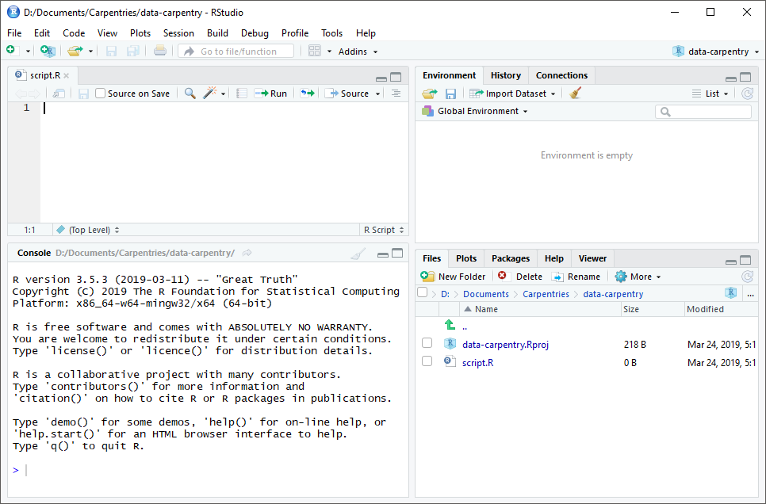
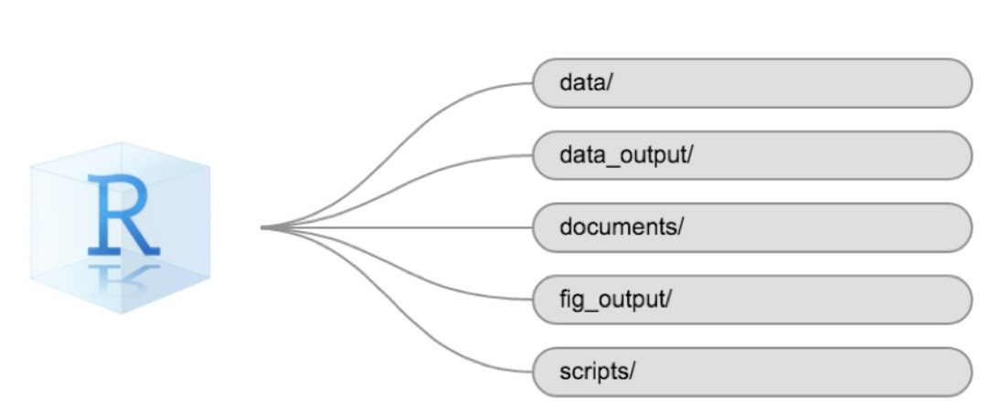
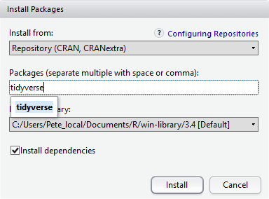

::: instructor

- Основна мета цього епізоду - допомогти слухачам комфортно почуватися під час користування інтерфейсом RStudio.
- У епізоді "Початкове налаштування" виконуйте усі етапи дуже повільно. Переконайтеся, що всі учасники встигають за ходом заняття (нагадайте їм користуватися наліпками для зворотного зв’язку). На цьому етапі домовтеся з помічниками, щоб вони ходили по аудиторії та допомагали учасникам. Дуже важливо впевнитися, що всі працюють у правильному робочому каталозі та створили підкаталог `data` (усі літери малі).

::::::::::::

::::::::::::::::::::::::::::::::::::::: objectives

- Встановити останню версію R.
- Встановити останню версію RStudio.
- Ознайомитися з інтерфейсом RStudio.
- Встановити додаткові пакети за допомогою вкладки "packages".
- Встановити додаткові пакети за допомогою команд R.

::::::::::::::::::::::::::::::::::::::::::::::::::

:::::::::::::::::::::::::::::::::::::::: questions

- Як орієнтуватися в RStudio?
- Як взаємодіяти з R?
- Як керувати робочим середовищем?
- Як встановити пакети?

::::::::::::::::::::::::::::::::::::::::::::::::::

## Що таке R? Що таке RStudio?

Термін "`R`" використовується як для позначення мови програмування, так і для програмного забезпечення, яке виконує скрипти, написані цією мовою.

[RStudio](https://rstudio.com) нині є дуже популярним середовищем не тільки для написання скриптів на R, але й взаємодії з програмним забезпеченням R. Для правильної роботи RStudio потребує R і тому обидва необхідно встановити на ваш комп'ютер.

Щоб полегшити роботу з R, ми будемо використовувати RStudio. RStudio є найпопулярнішим IDE (інтегроване середовище розробки) для R. IDE - це частина програмного забезпечення, яка надає інструменти для полегшення програмування.

Також ви можете використовувати функцію R Presentations, щоб представляти свою роботу у вигляді презентації HTML5, поєднуючи Markdown і код на R. Ви можете переглядати їх безпосередньо в R Studio або у браузері. Є багато варіантів налаштування слайдів презентації, зокрема можливість зображати рівняння у форматі LaTeX. Це може допомогти вам співпрацювати з іншими, а також застосовувати для викладання та використання в класі.

## Навіщо вивчати R?

### У R не потрібно багато клацати мишкою — і це добре

Крива навчання може бути крутішою, ніж в інших програм, але в R результати аналізу залежать не від того, чи ви запам’ятали послідовність клацань мишкою, а від написаних команд — і це добре! Тому, якщо ви хочете повторити аналіз після того, як зібрали більше даних, вам не потрібно згадувати, у якому порядку ви натискали кнопки, щоб отримати результат — достатньо просто знову запустити свій скрипт.

Робота зі скриптами робить кроки вашого аналізу зрозумілими, а написаний вами код може переглянути інша людина, щоб дати відгук і помітити помилки.

Робота зі скриптами змушує вас глибше розуміти те, що ви робите, і допомагає краще вивчати та усвідомлювати методи, які ви використовуєте.

### Код R сприяє відтворюваності

Відтворюваність — це коли інша людина (або навіть ви в майбутньому) може отримати ті самі результати з того самого набору даних, використовуючи той самий аналіз.

R інтегрується з іншими інструментами, щоб створювати публікації прямо з вашого коду. Якщо ви зберете більше даних або виправите помилку в наборі даних, графіки та статистичні тести у вашому документі оновляться автоматично.

Все більше журналів і грантодавців очікують, що аналізи будуть відтворюваними, тож знання R дає вам перевагу для виконання цих вимог.

Щоб ще більше підтримати відтворюваність і прозорість, існують пакети, які допомагають керувати залежностями: відстежувати, які пакети ми завантажуємо і як вони залежать від версії пакета, яку ви використовуєте.
Це допомагає переконатися, що наявні робочі процеси працюють стабільно й продовжують виконувати те саме, що й раніше.

Такі пакети, як renv, дозволяють “зберігати” й “завантажувати” стан бібліотеки вашого проєкту, а також відстежують версії пакетів, які ви використовуєте, і джерело, з якого їх можна отримати.

### R є міждисциплінарним і розширюваним

Маючи понад 10,000+ пакетів, які можна встановити для розширення її можливостей, R забезпечує середовище, що дозволяє поєднувати статистичні підходи з різних наукових дисциплін і підібрати саме ту аналітичну структуру, яка найкраще підходить для аналізу ваших даних. Наприклад, у R є пакети для аналізу зображень, GIS, часових рядів, популяційної генетики та багато іншого.

### R працює з даними будь-яких форм і розмірів

Навички, які ви здобуваєте в R, легко масштабуються разом із розміром вашого набору даних. Незалежно від того, чи має ваш набір даних сотні чи мільйони рядків, це не матиме особливого значення для вас.

R призначений для аналізу даних. У R є спеціальні структури даних і типи даних, які роблять роботу з пропущеними значеннями та статистичними факторами зручною.

R може підключатися до електронних таблиць, баз даних та багатьох інших форматів даних — як на вашому комп’ютері, так і в інтернеті.

### R створює високоякісну графіку

Можливості побудови графіків у R практично безмежні й дозволяють налаштувати будь-який аспект графіка, щоб якнайкраще передати зміст ваших даних.

### R має велику та привітну спільноту

Тисячі людей використовують R щодня. Багато з них готові допомогти вам через списки розсилки
та вебсайти, такі як [Stack Overflow](https://stackoverflow.com/),
або на [спільноті RStudio](https://community.rstudio.com/). Питання, які супроводжуються [короткими, відтворюваними фрагментами коду](https://www.tidyverse.org/help/), швидше за все, отримують компетентні відповіді.

### R не лише безплатна, вона також є з відкритим кодом і працює на різних операційних системах

Кожен може переглянути вихідний код, щоб побачити, як працює R. Завдяки такій прозорості менше шансів на помилки, а якщо ви (або хтось інший) їх знайдете — можна повідомити про них і виправити.

Оскільки R є відкритим кодом і підтримується великою спільнотою розробників та користувачів, існує дуже великий вибір сторонніх додаткових пакетів, які безплатно розширюють базові можливості R.

<figure>

<div class="row">

<div class="col-md-6">


</div>

<div class="col-md-6">


</div>

</div>

<figcaption>

RStudio розширює можливості R та спрощує написання коду і взаємодію з R. <a href="https://unsplash.com/photos/D19rXKDUPYM">Автор фото зліва</a>; <a href="https://unsplash.com/photos/Wec3M4dY_LE">Автор фото справа</a>.

</figcaption>

</figure>

## Огляд RStudio

## Знайомство з RStudio

Почнемо з вивчення [RStudio](https://www.rstudio.com/), який є
інтегрованим середовищем розробки (IDE) для роботи з R.

Відкрита версія RStudio IDE є безплатною за
[Загальна публічна ліцензія Affero (AGPL) v3](https://www.gnu.org/licenses/agpl-3.0.en.html).
RStudio IDE також доступна з комерційною ліцензією та пріоритетною email-підтримкою від RStudio, Inc.

Ми будемо використовувати RStudio IDE для написання коду, роботи з файлами на комп’ютері, перегляду створених змінних і візуалізації побудованих графіків. RStudio також можна використовувати для інших речей (наприклад, контролю версій, розробки пакетів, створення Shiny-застосунків), які ми не розглядатимемо під час цього курсу.

Однією з переваг використання RStudio є те, що вся інформація, необхідна для написання коду, доступна в одному вікні. Крім того, RStudio надає багато комбінацій клавіш, автодоповнення та підсвічування синтаксису для основних типів файлів, які ви використовуєте під час роботи в R. RStudio робить набір коду простішим і менш схильним до помилок.

## Налаштування

Це хороша практика зберегти набір пов'язаних даних, аналіз і текст
самою текою під назвою **робочий каталог**. Усі скрипти у цій теці можуть потім використовувати _відносні шляхи_ до файлів. Відносні шляхи вказують, де саме всередині проєкту знаходиться файл (на відміну від абсолютних шляхів, які показують розташування файлу на конкретному комп’ютері). Такий спосіб роботи значно полегшує перенесення вашого проєкту на інший комп’ютер або обмін ним з іншими, без потреби змінювати шляхи до файлів у кожному окремому скрипті.

RStudio надає зручні інструменти для цього через інтерфейс "Проєкти", який не лише створює для вас робочий каталог, але й запам’ятовує її розташування (що дозволяє швидко повертатися до неї). Цей інтерфейс також (за бажанням) зберігає ваші налаштування та відкриті файли, щоб вам було легше продовжити роботу після перерви.

### Створення нового проєкту

- У меню `File` (файл) натисніть `New project` (новий проєкт), виберіть `New directory` (новий каталог), потім `New project` (новий проєкт)
- Введіть назву цієї нової теки (або "каталогу") і виберіть зручне розташування  для неї. Це буде ваш **робочий каталог** до кінця дня (наприклад, `~/data-carpentry`)
- Натисніть `Create project` (створити проєкт)
- Створіть новий файл, у якому ми будемо писати наші скрипти. Перейдіть до File (файл) > New File (новий файл) > R script (скрипт R). Натисніть значок збереження на панелі інструментів і збережіть ваш скрипт як  "`script.R`".

Найпростіший спосіб відкрити проєкт RStudio після його створення - це перейти до теки, де збережено проєкт і двічі клацнути на файлі `.Rproj` (синій куб). Це відкриє RStudio і запустить вашу сесію R у тому **самому** каталозі, де знаходиться файл `.Rproj`. Усі ваші дані, графіки та скрипти тепер будуть відносними до каталогу проєкт. Проєкти RStudio мають додаткову перевагу: вони дозволяють відкривати кілька проєктів одночасно, кожен у власному каталозі проєкту. Це дозволяє тримати відкритими кілька проєктів одночасно, не заважаючи один одному.

### Інтерфейс RStudio

Давайте швидко ознайомимося з RStudio.

{alt='Скріншот запуску RStudio\ _'}

RStudio поділено на чотири "панелі". Розміщення цих панелей
та їх вміст можна налаштувати (див. меню, Tools (Інструменти) -> Global Options (Глобальні параметри) -> Pane Layout (Макет панелі)).

Макет за замовчуванням:

- Ліворуч вгорі - **Source**: ваші скрипти та документи
- Ліворуч унизу - **Console**: як виглядав би R без RStudio
- Праворуч угорі - **Environment/History**: тут можна побачити, що ви зробили
- Праворуч унизу - **Files** і інші вкладки: тут можна переглядати вміст проєкту/робочого каталогу, наприклад ваш файл Script.R

### Організація робочого каталогу

Використання послідовної структури тек у всіх ваших проєктах допоможе підтримувати порядок і полегшить знаходження та збереження файлів у майбутньому. Це може бути особливо корисним, коли у вас є кілька проєктів. Загалом, ви можете створити каталоги (теки) для **скриптів**, **даних** та **документів**. Ось - кілька прикладів запропонованих каталогів:

- **`data/`** Використовуйте цю теку для зберігання необроблених даних та проміжних наборів даних.
  З метою прозорості та [походження](https://en.wikipedia.org/wiki/Provenance), ви  повинні _завжди_ зберігати копію ваших необроблених даних доступною та максимально виконувати очищення й попередню обробку даних програмно (тобто за допомогою скриптів, а не вручну), наскільки це можливо.
- **`data_output/`** Коли вам потрібно змінити необроблені дані, може бути корисно зберігати змінені версії наборів даних в іншій теці.
- **`documents/`** Використовується для контурів, чернеток та іншого тексту.
- **`fig_output/`** Ця тека може зберігати графіку, створену вашими скриптами.
- **`scripts/`** Місце для зберігання ваших R-скриптів для різних аналізів або побудови графіків.

Вам можуть знадобитися додаткові каталоги або підкаталоги залежно від потреб вашого проєкту, але вони повинні складати основу вашого робочого каталогу.

{alt='Приклад структури робочого каталогу'}

### Робочий каталог

Робочий каталог - важливе поняття для розуміння. Це місце, де R буде шукати та зберігати файли. Коли ви пишете код для свого проєкту, ваші скрипти повинні посилатися на файли відносно кореня робочої директорії й лише на файли в межах цієї структури.

Використання проєктів RStudio полегшує роботу і гарантує належне налаштування робочого каталогу. Якщо вам потрібно перевірити це, ви можете використовувати `getwd ()`. Якщо з якоїсь причини ваш робочий каталог не збігається з місцем розташування вашого проєкту RStudio, ймовірно, ви відкрили R-скрипт або файл RMarkDown **не** ваш файл `.Rproj`. Вам необхідно закрити RStudio і відкрити файл `.Rproj`, двічі клацнувши на синьому кубі! Якщо вам коли-небудь потрібно змінити робочий каталог
у скрипті, `setwd ('my/path')` змінює робочий каталог. Це слід використовувати обережно, оскільки такий підхід ускладнює обмін аналізом між різними пристроями та іншими користувачами.

### Завантаження даних та налаштування

Для цього уроку ми будемо використовувати такі теки в нашому робочому каталозі: **`data/`**, **`data_output/`** та **`fig_output/`**. Давайте послідовно запишемо все з малих літер. Ми можемо створити їх через інтерфейс RStudio, натиснувши кнопку “New Folder” у панелі файлів (справа внизу), або безпосередньо в R, ввівши в консолі:


``` r
dir.create("data")
dir.create("data_output")
dir.create("fig_output")
```

Ви можете завантажити дані, використані для цього уроку, з GitHub або за допомогою R. Ви можете скопіювати дані з цього [посилання GitHub](https://github.com/datacarpentry/r-socialsci/blob/main/episodes/data/SAFI_clean.csv)
і вставити їх у файл під назвою `Safi_clean.csv` у каталозі `data/`, який ви щойно створили.
Або ви можете зробити це безпосередньо в R, скопіювавши та вставивши це у свій термінал (викладач може розмістити цей фрагмент коду в Etherpad):


``` r
download.file("https://raw.githubusercontent.com/datacarpentry/r-socialsci/main/episodes/data/SAFI_clean.csv","data/SAFI_clean.csv", mode = "wb")
```

## Взаємодія з R

Основою програмування є те, що ми записуємо інструкції, які комп’ютер має виконати, а потім даємо йому команду їх виконати. Ми записуємо або _кодуємо_ інструкції в R, тому що це спільна мова, яку розуміє і комп’ютер, і ми. Ми називаємо ці інструкції _командами_ і просимо комп’ютер виконати їх, тобто _виконати_ (або _запустити_) ці команди.

Існує два основних способи взаємодії з R: за допомогою консолі або за допомогою файлів скриптів
(звичайних текстових файлів, які містять ваш код). Консоль (у RStudio — це нижня ліва панель) — це місце, де можна вводити команди мовою R і комп’ютер одразу їх виконає. Це також місце, де будуть показані результати виконаних команд. Ви можете ввести команди безпосередньо в консоль і натиснути <kbd>Enter</kbd>, щоб виконати їх, але вони будуть втрачені, щойно ви закриєте сесію.

Оскільки ми хочемо, щоб наш код і робочий процес були відтворюваними, краще вводити потрібні команди в редактор скриптів і зберігати цей скрипт. Таким чином у нас залишається повний запис того, що ми зробили й будь-хто (включно з нами в майбутньому!)
зможуть легко відтворити результати на своєму комп'ютері.

RStudio дозволяє виконувати команди прямо з редактора скриптів за допомогою комбінації клавіш <kbd>Ctrl</kbd> + <kbd>Enter</kbd> (на Mac, <kbd>Cmd</kbd> + <kbd>Return</kbd>). Команда на поточному рядку в скрипті (позначена курсором) або всі команди в виділеному тексті будуть надіслані на консоль і виконані при натисканні <kbd>Ctrl</kbd> + <kbd>Enter</kbd>. Якщо в консолі є інформація, яка вам більше не потрібна, ви можете очистити її за допомогою <kbd>Ctrl</kbd> + <kbd>L</kbd>.
Ви можете знайти інші комбінації клавіш у цій
[шпаргалці RStudio про RStudio IDE](https://raw.githubusercontent.com/rstudio/cheatsheets/main/rstudio-ide.pdf).

На певному етапі аналізу ви можете перевірити вміст змінної
або структуру об'єкта без необхідності збереження запису в
вашому скрипті. Ви можете ввести ці команди та виконати їх безпосередньо в консолі.  RStudio надає комбінації клавіш <kbd>Ctrl</kbd> + <kbd>1</kbd> та <kbd>Ctrl</kbd> + <kbd>2</kbd>, що дозволяють переходити між скриптом і консоллю.

Якщо R готовий приймати команди, консоль R показує `>`. Якщо R отримає команду (шляхом введення, копіювання-вставлення або надіслану з редактора скриптів за допомогою <kbd>Ctrl</kbd> + <kbd>Enter</kbd>), R спробує виконати її й коли буде готовий, покаже результати та знову виведе новий `>`, щоб чекати на наступні команди.

Якщо R все ще чекає, коли ви введете більше тексту,
консоль покаже `+`. Це означає, що ви не закінчили введення
повної команди. Ймовірно, це пов'язано з тим, що ви не 'закрили' дужки або цитату, тобто у вас немає такої ж кількості лівих дужок, як правих дужок, або такої ж кількості початкових та закритих лапок.
Якщо таке трапляється, а ви думали, що закінчили вводити команду, натисніть у вікні консолі та натисніть <kbd>Esc</kbd>; це скасує незавершену команду та поверне вас до запиту `>`. Потім ви можете коригувати введену команду та виправити помилку.

## Встановлення додаткових пакетів за допомогою вкладки "пакети"

На додаток до базової інсталяції R, існує понад 10,000 додаткових пакетів, які можуть бути використані для розширення функціональності R. Багато з них були написані користувачами R і були доступні в центральних репозиторіях, який розміщений на CRAN, щоб кожен міг завантажити та встановити їх у власне середовище R. У вас вже має бути встановлено пакети 'ggplot2' та 'dplyr. Якщо ви цього не зробили, будь ласка, зробіть це зараз, використовуючи ці інструкції.

Ви можете перевірити, чи встановлений у вас пакет, переглянувши вкладку `packages` (за замовчуванням внизу праворуч). Ви також можете ввести команду `installed.packages() `в консоль і перевірити вивід.

! [] (fig/packages_pane.png) {alt='Скріншот панелі пакетів'}

Додаткові пакети можна встановити із вкладки 'packages'.
На вкладці пакетів натисніть значок 'Install' (Встановити) і почніть вводити назву потрібного пакета у текстовому полі. Під час введення тексту пакети, назви яких починаються з введених вами символів, будуть показуватися у випадному списку і ви зможете вибрати потрібний.

{alt='Скріншот вікна встановлення пакетів'}

У нижній частині вікна Install Packages (Встановити пакети) є прапорець ‘Install’ dependencies (Встановити залежності). Цю опцію за замовчуванням увімкнено, і зазвичай саме так і потрібно. Пакети можуть (і справді) використовувати функціональність, вбудовану в інші пакети, тому для того, щоб функції пакета, який ви встановлюєте, працювали правильно, може знадобитися встановлення інших пакетів разом із ним. Опція 'Install dependencies' (встановити залежності) забезпечує, щоб ці додаткові пакети також були встановлені.

:::::::::::::::::::::::::::::::::::::::  challenge

## Завдання

Використовуйте вкладку Console (Консоль) і Packages (Пакети), щоб переконатися, що у вас встановлено tidyverse.

:::::::::::::::  solution

## Відповідь

Прокрутіть вкладку пакетів вниз до ‘tidyverse'.  Ви також можете ввести кілька символів у вікно пошуку.
Пакет 'tidyverse' насправді є набором пакетів, включаючи
'ggplot2' та 'dplyr', які обидва потребують інших пакетів для коректної роботи.
Всі ці пакети будуть встановлені автоматично. Залежно від того, які пакети раніше були встановлені у вашому середовищі R, встановлення 'tidyverse' може бути дуже швидким або ж зайняти кілька хвилин. Під час встановлення на консолі будуть виводитися повідомлення, пов’язані з прогресом його виконання.
Ви зможете побачити всі пакети, які фактично встановлюються.

:::::::::::::::::::::::::

::::::::::::::::::::::::::::::::::::::::::::::::::

Оскільки процес встановлення отримує доступ до сховища CRAN, вам
знадобиться підключення до Інтернету для встановлення пакетів.

Також можна встановити пакети з інших репозиторіїв, в тому числі з Github або локальної файлової системи, але ми не будемо розглядати ці варіанти в цьому уроці.

## Встановлення додаткових пакетів за допомогою команд R

Якщо ви дивилися вікно консолі під час запуску встановлення 'tidyverse', можливо, ви помітили, що рядок


``` r
install.packages("tidyverse")
```

був записаний на консоль до початку інсталяційних повідомлень.

Ви також могли встановити пакети **`tidyverse`**, виконавши цю команду безпосередньо в терміналі R.

Ми будемо використовувати ще один пакет під назвою **`here`** протягом усього курсу для керування шляхами та каталогами. Ми обговоримо це більш детально в пізньому епізоді, але зараз ми встановимо його в консолі:


``` r
install.packages("here")
```

:::::::::::::::::::::::::::::::::::::::: keypoints

- Використовуйте RStudio для створення та запуску програм R.
- Використовуйте `install.packages()` для встановлення пакетів (бібліотек).

::::::::::::::::::::::::::::::::::::::::::::::::::


