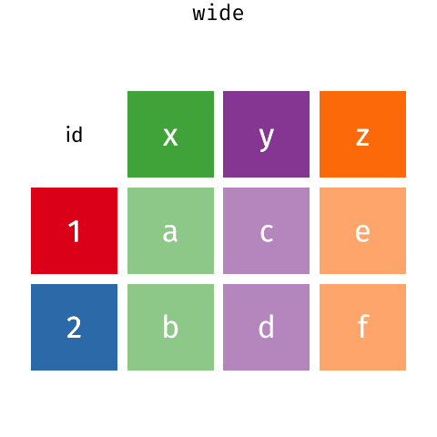
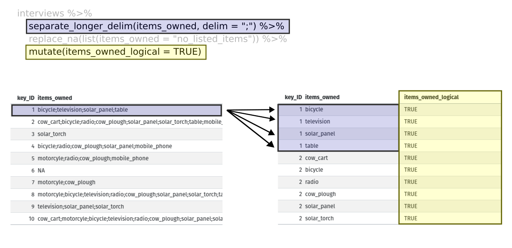
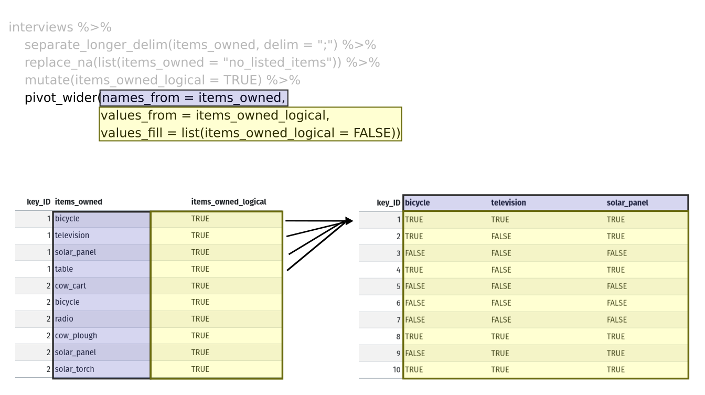

::::::::::::::::::::::::::::::::::::::: objectives

- Описати концепцію широкого та довгого форматів таблиць, а також цілі, для яких ці формати корисні.
- Описати ролі назв змінних та пов'язаних із ними значень під час зміни форми таблиці.
- Переформатувати датафрейм з довгого формату на широкий і назад за допомогою команд `pivot_wider` та `pivot_longer` з пакета **`tidyr`**.
- Експортувати дата фрейм у файл csv.

::::::::::::::::::::::::::::::::::::::::::::::::::

:::::::::::::::::::::::::::::::::::::::: questions

- Як я можу переформатувати датафрейм відповідно до своїх потреб?

::::::::::::::::::::::::::::::::::::::::::::::::::

**`dplyr`** чудово поєднується з **`tidyr`**, що дає змогу швидко
перетворювати дані між різними форматами (довгим і широким) для візуалізації та аналізу.
Щоб дізнатися більше про **`tidyr`** курсу, ви можете переглянути цю
[зручну шпаргалку з маніпулювання даними за допомогою **`tidyr`**](https://github.com/rstudio/cheatsheets/blob/main/tidyr.pdf).

Щоб переконатися, що всі використовуватимуть один і той самий набір даних для цього уроку, ми знову зчитаємо набір даних SAFI, який завантажили раніше.


``` r
## завантажити бібліотеку tidyverse
library(tidyverse)
library(here)

interviews <- read_csv(here("data", "SAFI_clean.csv"), na = "NULL")

## перевірте дані
interviews

## попередній перегляд даних
# view(interviews)
```

## Переформатування даних за допомогою pivot\_wider() і pivot\_longer()

Існує три основні правила, які визначають "охайний" набір даних:

1. Кожна змінна має свій стовпець
2. Кожне спостереження має свій рядок
3. Кожне значення має свою окрему клітинку

Цей графік візуально ілюструє три правила, що визначають "охайний" набір даних:


_R for Data Science_, Wickham H and Grolemund G ([https://r4ds.had.co.nz/index.html](https://r4ds.had.co.nz/index.html))
© Wickham, Grolemund 2017
This image is licenced under Attribution-NonCommercial-NoDerivs 3.0 United States (CC-BY-NC-ND 3.0 US)

У цьому розділі ми розглянемо, як ці правила пов’язані з різними форматами даних, які зазвичай цікавлять дослідників: "широким" і "довгим". Цей матеріал допоможе вам ефективно змінювати форму ваших даних незалежно від їх початкового формату. Спершу ми розглянемо характеристики даних `interviews` і те, як вони пов’язані з різними типами форматів даних.

### Довгі та широкі формати даних

У наборі даних `interviews` кожен рядок містить значення змінних, пов’язаних із кожним записом (кожним інтерв’ю у селах). Зазначено, що `key_ID` "додано для надання унікального ідентифікатора для кожного спостереження", а `instanceID` "робить те саме, але його не так зручно використовувати".

Після того, як ми визначили, що `key_ID` і `instanceID` обидва є унікальними, ми можемо використовувати будь-яку з цих змінних як ідентифікатор для 131 запису інтерв’ю.


``` r
interviews %>% 
  select(key_ID) %>% 
  distinct() %>%
  nrow()
```

``` output
[1] 131
```

Як видно з наведеного нижче коду, для кожної дати інтерв’ю в кожному селі `instanceID`s не повторюються. Таким чином, цей формат називається "довгим" форматом даних, де кожне спостереження займає лише один рядок у датафреймі.


``` r
interviews %>%
  filter(village == "Chirodzo") %>%
  select(key_ID, village, interview_date, instanceID) %>%
  sample_n(size = 10)
```

``` output
# A tibble: 10 × 4
   key_ID village  interview_date      instanceID                               
    <dbl> <chr>    <dttm>              <chr>                                    
 1     57 Chirodzo 2016-11-16 00:00:00 uuid:a7184e55-0615-492d-9835-8f44f3b03a71
 2     54 Chirodzo 2016-11-16 00:00:00 uuid:273ab27f-9be3-4f3b-83c9-d3e1592de919
 3     53 Chirodzo 2016-11-16 00:00:00 uuid:cc7f75c5-d13e-43f3-97e5-4f4c03cb4b12
 4     36 Chirodzo 2016-11-17 00:00:00 uuid:c90eade0-1148-4a12-8c0e-6387a36f45b1
 5     59 Chirodzo 2016-11-16 00:00:00 uuid:1936db62-5732-45dc-98ff-9b3ac7a22518
 6    192 Chirodzo 2017-06-03 00:00:00 uuid:f94409a6-e461-4e4c-a6fb-0072d3d58b00
 7     49 Chirodzo 2016-11-16 00:00:00 uuid:2303ebc1-2b3c-475a-8916-b322ebf18440
 8     62 Chirodzo 2016-11-16 00:00:00 uuid:c6597ecc-cc2a-4c35-a6dc-e62c71b345d6
 9     10 Chirodzo 2016-12-16 00:00:00 uuid:8f4e49bc-da81-4356-ae34-e0d794a23721
10     70 Chirodzo 2016-11-16 00:00:00 uuid:1feb0108-4599-4bf9-8a07-1f5e66a50a0a
```

Можемо помітити, що структура або формат даних `interviews` відповідає правилам 1-3, де

- кожен стовпець є змінною
- кожен ряд є спостереженням
- кожне значення має свою окрему клітинку

Це називають "довгим" форматом даних. Але зауважте, що кожен стовпець представляє різну змінну. У "найдовшому" форматі даних було б лише три стовпці: один для змінної-ідентифікатора, один для спостережуваної змінної та один для спостережуваного значення цієї змінної. Такий формат даних досить незручний і складний для роботи, тому його рідко використовують на практиці.

Крім того, у "широкому" форматі даних спостерігаються зміни в правилі 1: тепер кожен стовпець більше не обов’язково представляє лише одну змінну. Натомість стовпці можуть зображати різні рівні/значення змінної. Наприклад, у деяких наборах даних дослідники могли обрати, щоб кожна дата опитування була окремим стовпцем.

Хоча ці формати можуть здаватися радикально різними, існують інструменти, які роблять перехід між ними значно простішим, ніж може здатися! Гіф нижче показує, як ці два формати пов’язані між собою і дає уявлення про те, як можна використовувати R для переходу від одного формату до іншого.


Розташування даних у довгому та широкому форматах головним чином впливає на зручність перегляду. Візуально вам може більше подобатися "широкий" формат, оскільки на екрані можна побачити більше даних. Проте всі функції R, які ми використовували досі, очікують, що дані будуть у "довгому" форматі. Це пояснюється тим, що довгий формат легше сприймається машиною і ближчий до формату баз даних.

### Питання, які вимагають різних форматів даних

У даних інтерв’ю кожен рядок містить значення змінних, пов’язаних із кожним записом (одиницею), такі як село респондента, кількість членів домогосподарства або тип стіни їхнього будинку. Такий формат дозволяє порівнювати окремі опитування, але що робити, якщо ми хочемо розглянути відмінності між домогосподарствами, згрупованими за різними типами власності?

Щоб полегшити таке порівняння, потрібно створити нову таблицю, де кожен рядок (одиниця) складатиметься зі значень змінних, пов’язаних із власністю (тобто `items_owned`). Практично це означає, що значення елементів у `items_owned` (наприклад, велосипед, радіо, стіл тощо) стануть назвами стовпців, а клітинки міститимуть значення `TRUE` або `FALSE`, залежно від того, чи має домогосподарство цей предмет.

Після створення такої таблиці ми можемо досліджувати взаємозв’язки всередині та між селами. Ключовий момент тут у тому, що ми все ще дотримуємося структури охайних даних, але **переформатували** дані відповідно до потрібних спостережень.

Крім того, якщо дати інтерв’ю розташовані у кількох стовпцях, а нас цікавить візуалізація того, як змінювалися конфлікти щодо зрошення з часом у кожному селі. Для цього потрібно, щоб дати інтерв’ю були включені в один стовпець, а не розкидані по кількох. Таким чином, нам потрібно перетворити назви стовпців на значення змінної.

Обидві ці трансформації можна виконати за допомогою двох функцій пакета `tidyr`: `pivot_wider()` та `pivot_longer()`.

## Перетворення у широкий формат

`pivot_wider()` має три основні аргументи:

1. дані
2. змінна _names\_from_, значення якої стануть новими назвами стовпців.
3. змінна _values\_from_, значення якої заповнюватимуть нові стовпці.

Додаткові аргументи включають `values_fill`, який, якщо його встановити, заповнює пропущені значення вказаним значенням.

Використаймо `pivot_wider()`, щоб перетворити interviews і створити нові стовпці для кожного предмета, яким володіє домогосподарство.
У цій трансформації є кілька нових концепцій, тому розглянемо її крок за кроком. Спершу ми створимо новий об’єкт (`interviews_items_owned`) на основі датафрейму `interviews`.


``` r
interviews_items_owned <- interviews %>%
```

Тоді нам насправді потрібно зробити наш датафрейм довшим, тому що в одній клітинці міститься кілька предметів.
Ми використаємо нову функцію `separate_longer_delim()` з пакета **`tidyr`**, щоб розділити значення змінної `items_owned` за наявністю крапок з комою (`;`).
Значення цієї змінної містили кілька предметів, розділених крапками з комою, тому ця операція створює окремий рядок для кожного предмета, зазначеного у власності домогосподарства.
Таким чином ми отримуємо довгу версію набору даних — з кількома рядками для кожного респондента. Наприклад, якщо респондент має телевізор і сонячну панель, то тепер у нього буде два рядки: один із "television", а інший із "solar panel" у стовпці `items_owned`.


``` r
separate_longer_delim(items_owned, delim = ";") %>%
```

Після цього перетворення ви можете помітити, що в стовпці `items_owned` з’явилися значення NA. Це тому, що деякі респонденти не володіли жодним із предметів, зазначених у списку інтерв’юера. Ми можемо використати функцію `replace_na()`, щоб замінити ці `NA` на більш змістовне значення. Функція `replace_na()` очікує, що ви передасте їй `list()` зі стовпцями, у яких хочете замінити значення `NA`, а також значення, на яке потрібно замінити ці `NA`. У результаті це виглядає так:


``` r
replace_na(list(items_owned = "no_listed_items")) %>%
```

Далі ми створюємо нову змінну `items_owned_logical`, яка має значення (`TRUE`) для кожного рядка. Це логічно, адже кожен предмет у кожному рядку належав відповідному домогосподарству. Ми створюємо цю змінну для того, щоб під час розширення `items_owned` у кілька стовпців можна було заповнити їх логічними значеннями, які показують, чи володіло домогосподарство відповідним предметом (`TRUE`) або ні (`FALSE`).


``` r
mutate(items_owned_logical = TRUE) %>%
```

{alt="Дві таблиці, показані поруч. Перший рядок лівої таблиці виділено синім, а перші чотири рядки правої таблиці також виділено синім, щоб показати, як кожне значення з 'items owned' отримало окремий рядок за допомогою функції separate_longer_delim(). Стовпець 'items owned logical' виділено жовтим у правій таблиці, щоб показати, як функція mutate додає новий стовпець."}

На цьому етапі ми також можемо порахувати кількість предметів, якими володіє кожне домогосподарство, що еквівалентно кількості рядків для кожного `key_ID`. Ми можемо зробити це за допомогою `group_by()` та `mutate()`, який працює схоже на комбінацію `group_by()` і `summarize()`, розглянуту в попередньому прикладі, але замість створення підсумкової таблиці ми додамо новий стовпець `number_items`. Для підрахунку кількості рядків у кожній групі використовується функція `n()`. Однак потрібно врахувати один момент: домогосподарства, які не зазначили жодного предмета. У цих домогосподарств тепер у стовпці `items_owned` зазначено `"no_listed_items"`. Ми не хочемо рахувати це як предмет, тому замість цього потрібно поставити нуль. Цього можна досягти за допомогою функції `if_else()` з пакета **`dplyr`**, яка оцінює умову і повертає одне значення, якщо умова істинна, і інше — якщо хибна. Тут, якщо стовпець `items_owned` дорівнює `"no_listed_items"`, повертається 0, інакше кількість рядків у групі повертається за допомогою `n()`.


``` r
group_by(key_ID) %>% 
  mutate(number_items = if_else(items_owned == "no_listed_items", 0, n())) %>% 
```

Нарешті ми використовуємо `pivot_wider()`, щоб перейти з довгого формату в широкий. Це створює новий стовпець для кожного унікального значення у стовпці `items_owned` і заповнює ці стовпці значеннями з `items_owned_logical`. Крім того, ми вказуємо, що для відсутніх предметів клітинки потрібно заповнювати значенням `FALSE` замість `NA`.


``` r
pivot_wider(names_from = items_owned,
            values_from = items_owned_logical,
            values_fill = list(items_owned_logical = FALSE))
```

{alt="Дві таблиці, показані поруч. Стовпець 'items owned' виділено синім у лівій таблиці, а назви стовпців виділено синім у правій таблиці, щоб показати, як значення зі стовпця 'items owned' стають назвами стовпців у результаті функції pivot_wider. Стовпець 'items owned logical' виділено жовтим у лівій таблиці, а значення стовпців bicycle, television і solar panel виділено жовтим у правій таблиці, щоб показати, як значення стовпця 'items owned logical' стали значеннями цих трьох стовпців."}

Об’єднавши наведені кроки, код виглядає так. Зверніть увагу, що два нові стовпці створюються в одному виклику mutate().


``` r
interviews_items_owned <- interviews %>%
  separate_longer_delim(items_owned, delim = ";") %>%
  replace_na(list(items_owned = "no_listed_items")) %>%
  group_by(key_ID) %>%
  mutate(items_owned_logical = TRUE,
         number_items = if_else(items_owned == "no_listed_items", 0, n())) %>%
  pivot_wider(names_from = items_owned,
              values_from = items_owned_logical,
              values_fill = list(items_owned_logical = FALSE))
```

Перегляньте дата фрейм `interviews_items_owned`. Він має `rnrow(interviews)` рядків (таку ж кількість, як і спочатку), але додаткові стовпці для кожного предмета. Скільки стовпців було додано? Зверніть увагу, що більше немає стовпця `items_owned`. Це тому, що в `pivot_wider()` за замовчуванням встановлено параметр, який видаляє оригінальний стовпець. Значення, які були в цьому стовпці, тепер стали стовпцями з назвами `television`, `solar_panel`, `table` тощо. Ви можете використати `dim(interviews)` та `dim(interviews_wide)`, щоб побачити, як змінилася кількість стовпців між двома наборами даних.

Такий формат даних дозволяє виконувати цікаві операції, наприклад, створювати таблицю, що показує кількість респондентів у кожному селі, які володіли певним предметом:


``` r
interviews_items_owned %>%
  filter(bicycle) %>%
  group_by(village) %>%
  count(bicycle)
```

``` output
# A tibble: 3 × 3
# Groups:   village [3]
  village  bicycle     n
  <chr>    <lgl>   <int>
1 Chirodzo TRUE       17
2 God      TRUE       23
3 Ruaca    TRUE       20
```

Або нижче ми обчислюємо середню кількість предметів зі списку, якими володіли респонденти в кожному селі, використовуючи стовпець `number_items`, який ми створили для підрахунку предметів у кожного домогосподарства.


``` r
interviews_items_owned %>%
    group_by(village) %>%
    summarize(mean_items = mean(number_items))
```

``` output
# A tibble: 3 × 2
  village  mean_items
  <chr>         <dbl>
1 Chirodzo       4.54
2 God            3.98
3 Ruaca          5.57
```

:::::::::::::::::::::::::::::::::::::::  challenge

## Завдання

Ми створили `interviews_items_owned`, переформатувавши дані: спочатку у довгий формат, а потім у широкий. Виконайте цей самий процес для стовпця `months_lack_food у дата фреймі `interviews`. Створіть новий дата фрейм зі стовпцями для кожного місяця, заповненими логічними значеннями (`TRUE`або`FALSE`) та додайте підсумковий стовпець `number_months_lack_food\`, який обчислює кількість місяців, протягом яких домогосподарство повідомляло про нестачу їжі.

Зверніть увагу: якщо домогосподарство не відчувало нестачі їжі протягом останніх 12 місяців, у стовпці було введено "none".

:::::::::::::::  solution

## Відповідь


``` r
months_lack_food <- interviews %>%
  separate_longer_delim(months_lack_food, delim = ";") %>%
  group_by(key_ID) %>%
  mutate(months_lack_food_logical = TRUE,
         number_months_lack_food = if_else(months_lack_food == "none", 0, n())) %>%
  pivot_wider(names_from = months_lack_food,
              values_from = months_lack_food_logical,
              values_fill = list(months_lack_food_logical = FALSE))
```

:::::::::::::::::::::::::

::::::::::::::::::::::::::::::::::::::::::::::::::

## Перетворення у довгий формат

Протилежна ситуація може виникнути, якщо нам надали дані у форматі `interviews_wide`, де предмети, якими володіють домогосподарства, записані як назви стовпців, але ми хочемо розглядати їх як значення змінної `items_owned`.

У такій ситуації ми «збираємо» ці стовпці, перетворюючи їх на пару нових змінних. Одна змінна міститиме назви стовпців як значення,
а інша — значення кожної клітинки, які раніше були пов’язані з цими назвами стовпців. Ми зробимо це у два кроки, щоб процес був зрозумілішим.

`pivot_longer()` приймає чотири основні аргументи:

1. дані
2. _cols_ - назви стовпців, які ми використовуємо для заповнення нової змінної значень (або для видалення).
3. _names_to_ - назва нової змінної, яку ми хочемо створити з наданих _cols_.
4. _values_to_ — назва нової змінної, яку ми хочемо створити та заповнити значеннями, пов’язаними з наданими _cols_.


``` r
interviews_long <- interviews_items_owned %>%
  pivot_longer(cols = bicycle:car,
               names_to = "items_owned",
               values_to = "items_owned_logical")
```

Перегляньте обидва датафрейми `interviews_long` та `interviews_items_owned` і порівняйте їхню структуру.

:::::::::::::::::::::::::::::::::::::::  challenge

## Завдання

Ми створили деякі підсумкові таблиці для `interviews_items_owned` за допомогою `count` та `summarise`. Ми можемо створити ті самі таблиці на основі `interviews_long`, але процес буде іншим.

Створіть таблицю, яка показує кількість респондентів у кожному селі, які володіли певним предметом, включаючи всі предмети. Різниця між цим форматом і широким форматом у тому, що тепер можна рахувати всі предмети, використовуючи змінну `items_owned`.

:::::::::::::::  solution

## Відповідь


``` r
interviews_long %>%
  filter(items_owned_logical) %>% 
  group_by(village) %>% 
  count(items_owned)
```

``` output
# A tibble: 47 × 3
# Groups:   village [3]
   village  items_owned         n
   <chr>    <chr>           <int>
 1 Chirodzo bicycle            17
 2 Chirodzo computer            2
 3 Chirodzo cow_cart            6
 4 Chirodzo cow_plough         20
 5 Chirodzo electricity         1
 6 Chirodzo fridge              1
 7 Chirodzo lorry               1
 8 Chirodzo mobile_phone       25
 9 Chirodzo motorcyle          13
10 Chirodzo no_listed_items     3
# ℹ 37 more rows
```

:::::::::::::::::::::::::

::::::::::::::::::::::::::::::::::::::::::::::::::

## Застосування отриманих знань для очищення даних

Тепер ми одночасно ознайомилися з `pivot_longer()` та `pivot_wider()` і виправили проблему в структурі наших даних. У цьому наборі даних є ще один стовпець, який містить кілька значень в одній клітинці. Деякі клітинки стовпця `months_lack_food` містять кілька місяців, які, як і раніше, розділені крапкою з комою (;).

Щоб створити датафрейм, де кожен стовпець містить лише одне значення в клітинці, ми можемо повторити ті ж кроки, що застосовували для `items_owned`, і застосувати їх до `months_lack_food`. Оскільки цей датафрейм ми будемо використовувати в наступному розділі, назвемо його `interviews_plotting`.


``` r
## Візуалізація даних ##
interviews_plotting <- interviews %>%
  ## pivot wider by items_owned
  separate_longer_delim(items_owned, delim = ";") %>%
  replace_na(list(items_owned = "no_listed_items")) %>%
  ## Use of grouped mutate to find number of rows
  group_by(key_ID) %>% 
  mutate(items_owned_logical = TRUE,
         number_items = if_else(items_owned == "no_listed_items", 0, n())) %>% 
  pivot_wider(names_from = items_owned,
              values_from = items_owned_logical,
              values_fill = list(items_owned_logical = FALSE)) %>% 
  ## pivot wider by months_lack_food
  separate_longer_delim(months_lack_food, delim = ";") %>%
  mutate(months_lack_food_logical = TRUE,
         number_months_lack_food = if_else(months_lack_food == "none", 0, n())) %>%
  pivot_wider(names_from = months_lack_food,
              values_from = months_lack_food_logical,
              values_fill = list(months_lack_food_logical = FALSE))
```

## Експорт даних

Тепер, коли ви навчилися використовувати **`dplyr`** та **`tidyr`** для обробки сирих даних, можливо, ви захочете експортувати ці нові набори даних, щоб поділитися ними з колегами або зберегти для архіву.

Подібно до функції `read_csv()`, яка використовується для зчитування CSV-файлів у R, існує функція `write_csv()`, яка дозволяє створювати CSV-файли з датафреймів.

Перед використанням `write_csv()` ми створимо нову теку `data_output` у нашій робочій директорії, куди будемо зберігати згенерований набір даних. Не слід записувати згенеровані набори даних у ту саму директорію, де зберігаються сирі дані. Хорошою практикою є тримати їх окремо. Тека `data` повинна містити лише сирі, незмінені дані, щоб уникнути їх випадкового видалення або зміни. Натомість скрипт буде створювати вміст теки `data_output`, тому навіть якщо файли там будуть видалені, їх завжди можна повторно згенерувати.

Для підготовки до наступного уроку з візуалізації ми створили версію набору даних, де кожен стовпець містить лише одне значення. Тепер ми можемо зберегти цей датафрейм у теку `data_output`.


``` r
write_csv(interviews_plotting, file = "data_output/interviews_plotting.csv")
```


:::::::::::::::::::::::::::::::::::::::: keypoints

- Використовуйте пакет `tidyr`, щоб змінювати структуру датафреймів.
- Використовуйте `pivot_width()` для переходу від довгого до широкого формату.
- Використовуйте `pivot_longer()` для переходу від широкого до довгого формату.

::::::::::::::::::::::::::::::::::::::::::::::::::

